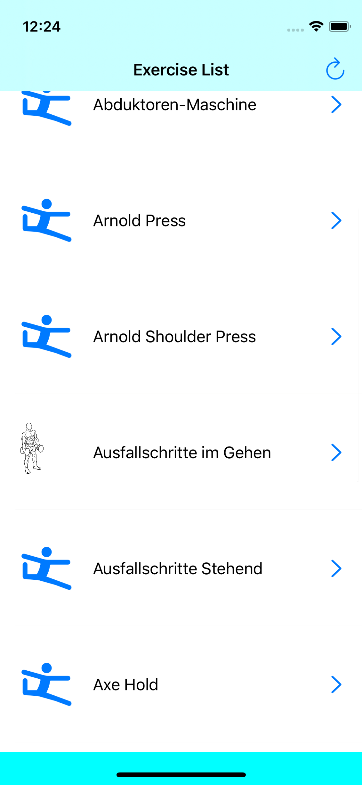
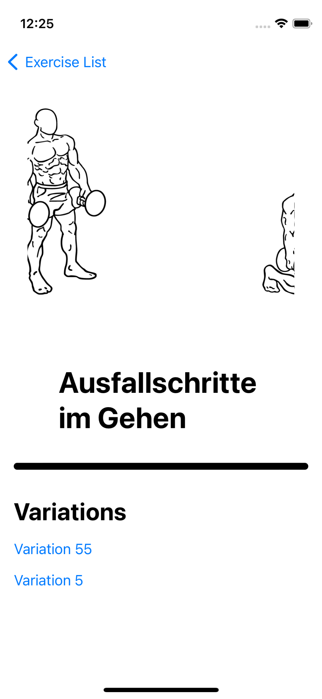

# GymBode
 

Browse exercises, see details and variations.

## How to run
1. Clone the repo
2. Open GymBode.xcodeproj
3. Select a simualtor and click on run (CMD+R)

## How to use GymBode
1. Once the app is running and you'll see an empty page and on top of that a title says Exercise List. 
2. Tap on the refresh button located on the top right side to load exercises.
3. After a quick loading period see the list of exercises layed out below.
4. Tap one of them to see details.
5. On the detai page, you can tap on a variation and it will take you to the detail page of that variation.

## Features

- [x] List and browse exercises,
- [x] See the details of an exercise
- [x] Browse variations of an exercise

## Technology and API

- UIKit
- SwiftUI
- Combine

## Requirements

- iOS > 14.0
- Xcode > 12.0
- Swift > 5.0

## External Libraries
Swift Package Manager is used. Libraries below should be readily available once you clone the repo and fetch once you run the project.

- Kingfisher

## Contact

iOS Developer - Can Dayan – hcan.dayan@gmail.com – [@LinkedIn](https://www.linkedin.com/in/can-d/) – [@Medium](https://activesludge.medium.com/) - [@Stackoverflow](https://stackoverflow.com/users/12594970/active-sludge)
____
